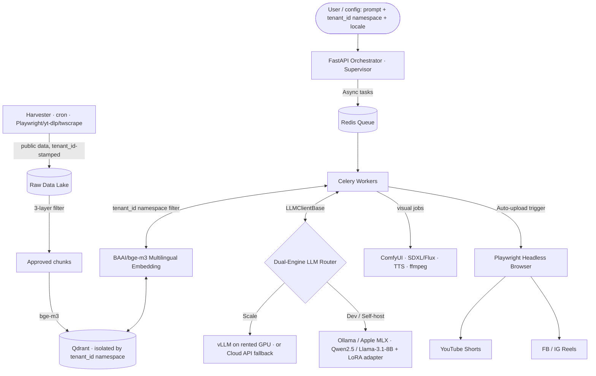

<!--
═══════════════════════════════════════════════════════════════════════════
🟢 REPO SCOPE BANNER — n-assistant-core (MIT · OPEN-SOURCE · SINGLE REPO)
═══════════════════════════════════════════════════════════════════════════
This is the architecture spec for the WHOLE project. There is ONE repo, MIT.
This is a personal / community LEARNING engine — an open-source "Virtual
Content Factory" you fork and customize for your own niche. It is NOT a SaaS
product: no billing, no user auth, no admin dashboard, no commercial cloud.

  • `tenant_id` exists ONLY as a namespace so one install can host several
    niches/users side by side in the vector store. It is NOT customer-billing
    isolation. Think "folder per niche", not "tenant per paying customer".
  • Everything runs standalone in Docker / on a self-hosted box. Zero
    dependency on any external SaaS layer.

See [`../rules/tech-stack-rule.md`](../rules/tech-stack-rule.md) for the
enforceable engineering rules.
═══════════════════════════════════════════════════════════════════════════
-->

# 🌍 ARCHITECTURE SPECIFICATION — N-Assistant Core (V4.0, Learning Edition)

> **V4.0 changelog (De-SaaS & Full Learning Roadmap):** removes the B2B-SaaS / two-repo "Open-Core" framing entirely — this is now a single MIT repo built as a learning vehicle. Reframes `tenant_id` from customer isolation to a **namespace for multiple niches/users**. Adds the visual/character engine, advanced RAG (Hybrid + RRF + CRAG), LoRA fine-tuning, evaluation, and light MLOps as first-class layers. Canonical roadmap: [`master-execution-plan.md`](master-execution-plan.md).
>
> **DOCUMENT CLASSIFICATION:** Core engineering spec. Binding for every AI agent and human contributor on the project.
> **PROJECT VISION:** N-Assistant Core is an open-source, modular **Virtual Content Factory** — fork it for your niche (MMO, Game AI, Beauty, Crypto, Education…), run it 100% local. The point is to *learn* the full autonomous-content stack from scratch: harvest → RAG → reason → fine-tune → generate visuals/video → publish.
> **LANGUAGES SUPPORTED END-TO-END:** Vietnamese (VN), English (EN), German (DE), Chinese (CN).
> **CONSTITUTIONAL FILES:** This doc · [`../rules/tech-stack-rule.md`](../rules/tech-stack-rule.md) · [`ai-agent-design.md`](ai-agent-design.md).

---

## §0. GLOBAL STRATEGIC VISION (System Prompts)

Inject the locale-matched line into the root context of every working AI Agent.

- 🇻🇳 **Vietnamese:** N-Assistant Core là một Nhà máy Nội dung Ảo mã nguồn mở, modular — fork cho niche của bạn, chạy 100% local. Cốt lõi: RAG đa namespace, suy luận Hybrid (Local/Cloud), và phân phối nội dung đa nền tảng. Mục tiêu là học sâu toàn bộ stack.
- 🇬🇧 **English:** N-Assistant Core is an open-source, modular Virtual Content Factory — fork it for your niche, run it 100% local. The core is namespace-scoped RAG, hybrid inference routing (Local vs Cloud), and omnichannel auto-publishing. The goal is to learn the full stack deeply.
- 🇩🇪 **German:** N-Assistant Core ist eine quelloffene, modulare Virtual Content Factory — forke sie für deine Nische, betreibe sie 100% lokal. Kern: namespace-gebundenes RAG, hybride Inferenz (Lokal/Cloud), automatisierte Omnichannel-Veröffentlichung. Ziel ist tiefes Lernen des gesamten Stacks.
- 🇨🇳 **Chinese:** N-Assistant Core 是一个开源、模块化的虚拟内容工厂 — 为你的细分领域 fork，100% 本地运行。核心：按命名空间隔离的 RAG、混合推理路由（本地/云）、全渠道自动发布。目标是深入学习整个技术栈。

---

## §1. CODEBASE STRATEGY — One Repo, MIT

| Repo | License | Stack | What lives here |
|---|---|---|---|
| **`n-assistant-core`** | MIT (public) | Python 3.11 · FastAPI · LangGraph · Qdrant · Playwright · PyTorch · ComfyUI | Everything: harvester, RAG pipeline, agent workflows, fine-tuning scripts, visual/video engine, auto-upload bots. Runs in Docker, native on Mac M-series, or self-hosted GPU. |

**There is no second repo and no commercial layer.** Anything you'd expect in a SaaS — billing, user accounts, RBAC, an admin dashboard — is **out of scope by design**. A user-facing UI, if ever added, is a thin optional Streamlit/Gradio panel that calls the same local API; it never becomes a tenancy/billing system.

---

## §2. DATA FLOW (Single-Process, Local-First)



Optional persistence (Postgres) holds local config, source registry, and run history — **not** users or billing.

---

## §3. DETAILED ARCHITECTURE LAYERS

### §3.1 Entry & Config Layer

- **Primary interface:** the unified `cli.py` + the FastAPI orchestrator. Optional thin UI (Streamlit/Gradio) is a nice-to-have, never required.
- **Config-driven:** a single `config.yaml` (planned, Phase 7) lets a forker pick model, niche, character, output style without touching code. Harvester sources live in `scraper_config.yaml`.
- **Namespace, not auth:** requests carry a `tenant_id` namespace + `locale`. There is no login, no JWT, no role system. The namespace simply selects which niche's data and style apply.

### §3.2 Orchestration Layer

- **Framework:** Python FastAPI, Hexagonal Architecture (`app/domain`, `app/application`, `app/infrastructure`, `app/api`).
- **Responsibility:** receive a request, split documents (text splitter), drive the Supervisor-Worker agent graph (see [`ai-agent-design.md`](ai-agent-design.md)).
- **Hard rule:** when `INFERENCE_MODE=self_hosted`, the orchestrator **MUST NOT** make any outbound HTTPS call to OpenAI/Anthropic/Gemini. CI gate verifies via `grep`. (Privacy-by-default for a fully-local fork.)

### §3.3 Multi-Niche RAG Layer

- **Vector DB:** Qdrant (the single approved vector store).
- **Namespace isolation:** a dedicated collection per niche, or a single collection with a **mandatory** `tenant_id` payload filter on every `upsert` and `search`. Cross-namespace bleed is an architectural violation — your MMO niche must never retrieve Game-AI chunks.
- **Pipeline:** LangChain text splitters → `BAAI/bge-m3` embedding → Qdrant upsert with metadata `{tenant_id, doc_id, source, locale, ingested_at}`.
- **Cross-lingual capability:** `bge-m3` produces a single shared embedding space across VN/EN/DE/CN → a Vietnamese niche can query its German knowledge base without a translation pre-pass.
- **Advanced RAG (Phase 3):** Hybrid Search (dense + sparse/BM25) fused with **Reciprocal Rank Fusion (RRF)**, then **Corrective RAG (CRAG)** as a LangGraph loop that grades retrieval quality and self-corrects (re-query / web fallback) before generation. A per-niche **domain adapter** biases retrieval toward the active niche.
- **Learning focus:** code cosine similarity and the RRF formula by hand before leaning on libraries.

### §3.4 Dual-Engine AI Inference

A single OpenAI-compatible interface `LLMClientBase` lets agents swap engines via config without code change.

```python
class LLMClientBase(Protocol):
    async def complete(self, *, messages: list[Message], tools: list[Tool] | None = None, max_tokens: int) -> Completion: ...
```

| Tier | Use case | Implementation |
|---|---|---|
| **Local / Dev** | Zero-cost R&D, offline work, full privacy | Ollama (`:11434`) or Apple MLX serving `Qwen2.5-7B` or `Llama-3.1-8B-Instruct`, optionally with a fine-tuned LoRA adapter |
| **Scale** | Heavy batch / large dataset runs | vLLM on a rented GPU (RunPod, AWS, Lambda Labs), or fallback to a cloud API for peak load |

Routing decision is config (`INFERENCE_MODE=local|cloud|hybrid`), not code. Agent code is identical across tiers.

### §3.5 Fine-tuning Layer (Phase 4)

- **Method:** LoRA (low-rank adaptation) on `Qwen2.5-7B`. Train a **base adapter** on the shared content style + optional **per-niche adapters** (MMO, Game AI…). A forker can train their own adapter for their niche — this is a core open-source value.
- **Dataset design:** multi-domain — a common base dataset plus per-niche fine-tune examples. Track JSON-output parsing rate, style consistency, and hallucination rate before/after.
- **Quantization & serving:** merge adapter → GGUF (Q4/Q5/Q8) → serve via Ollama.
- **Learning focus:** the low-rank update math (`W + ΔW = W + B·A`), why rank `r` matters, and quantization trade-offs.

### §3.6 Visual & Character Engine (Phase 5)

- **Consistent character / avatar:** ComfyUI + IP-Adapter + FaceID + a character LoRA so the same virtual KOL / game character appears across videos. Forkers can train their own character.
- **Image generation:** Flux / SDXL + ControlNet (pose, outfit, product placement). The LLM emits structured JSON with `visual_prompt`, `style`, `scene` fields that drive the pipeline.
- **Video:** image-to-video / text-to-video (local models), lip-sync, TTS voice cloning (XTTS / CosyVoice), auto-editing with ffmpeg (subtitles, trend music, transitions).
- **Modular plugin system:** a forker can add their own ComfyUI workflow for their niche (e.g. Game-AI gameplay footage + AI-commentary overlay).

### §3.7 Async Jobs, Observability & Evaluation Layer

- **Workers:** Redis broker + Celery for any task >2s (PDF ingest, embedding batches, video render, Playwright upload). Progress via WebSocket or polling.
- **Logging:** `structlog` with fields `{tenant_id, request_id, agent, tool, latency_ms, token_usage, retrieval_score}`. Token counting emits **usage metadata for observability** — there is no wallet/billing debit.
- **Monitoring:** LangFuse or Prometheus + Grafana for latency, token usage, and retrieval scores (Phase 7).
- **Evaluation (Phase 7):** RAGAS (faithfulness, relevance, answer correctness) + custom metrics for script quality, visual consistency, and an engagement proxy. LLM-as-Judge and small human-eval sets. Before/after fine-tuning comparison on a fixed test set.
- **Error handling & fallback:** every layer fails safe (e.g. if CRAG can't ground an answer, the Critic refuses to pass it).

### §3.8 Harvester Layer (Data Ingestion — strictly separate from Inference)

The Harvester is an **autonomous data-acquisition subsystem**, fully decoupled
from the LLM agent graph. It enforces a hard separation of concerns:
**Data Ingestion ≠ Inference.** The Harvester only *acquires and lands* data; it
never reasons, never calls an LLM, and shares no process with the agents.

- **Engine:** plugin extractors (Playwright + `playwright-stealth`, `yt-dlp`, `twscrape`), driven on a schedule by **cron / Celery Beat**.
- **Zero-hardcode sources:** every scraping target is declared in
  **`scraper_config.yaml`** (URL, selectors, cadence, locale, `tenant_id`).
  **No URL is ever hardcoded in Python.** Reloading the YAML reconfigures the
  harvester without a redeploy.
- **Pipeline (4 stages):**
  1. **Crawl** — fetch the configured *public* pages.
  2. **Raw Data Lake** — raw JSON landed immutably, stamped with
     `{tenant_id, source, harvested_at}` **at this layer already**.
  3. **Filter (Clean)** — 3-layer anti-spam (L1 heuristic → L2 text-clean →
     L3 batched LLM judge), dedupe, language detect.
  4. **Vector Ingestion** — cleaned chunks → `BAAI/bge-m3` → **Qdrant** upsert
     with the mandatory `tenant_id` namespace filter (same isolation as §3.3).
- **Isolation from agents:** the Harvester *writes* to Qdrant; the Researcher
  agent only *reads*. They never call each other.

**Compliance (binding):**
- Harvest **public data only.** Respect `robots.txt` / platform ToS; rate-limit per source.
- **`tenant_id` is stamped at the Harvester layer** — on the very first raw file,
  not bolted on downstream. A harvested artifact missing `tenant_id` is discarded.

### §3.9 Extensibility & Community Layer (Phase 8)

- **Plugin architecture everywhere:** new scraper, new visual backend, new TTS, new LLM client — all drop-in via a one-file contract.
- **Niche templates:** MMO Affiliate, Game AI, Tech, Education… ship as example configs + datasets so a forker is productive in minutes.
- **Example projects:** e.g. "How to make Game-AI Shorts in 5 minutes."

---

## §4. STRICT EXECUTION DISCIPLINE

1. **TDD is mandatory.** Every RAG, agent, and tool change requires red→green→refactor. RAG logic requires **cross-language tests** (VN, EN, DE, CN). No green CI → no merge.
2. **Micro-commits.** Each working function ships as its own commit. Conventional Commits format.
3. **Namespace isolation.** No library outside the approved stack without a note in the spec. The `tenant_id` namespace check is non-negotiable on every DB / Vector DB path.
4. **No raw LLM API calls.** Always go through `LLMClientBase`. Direct `openai.*` or `transformers.pipeline(...)` calls in agent code are a CI failure.
5. **Local-first & extensible.** Default to a fully-local, offline-capable path. New sources/backends are plugins, not core edits.

---

## §5. NON-FUNCTIONAL TARGETS (Learning Benchmarks, not SLAs)

These are targets to *measure and learn from* on a personal/self-hosted box — not customer SLAs.

| Concern | Target |
|---|---|
| RAG query latency | p95 < 800ms on Mac M-series MPS for top-k retrieval |
| LLM tool-call latency | p95 < 4s (local Qwen2.5-7B) / < 2s (rented vLLM GPU) |
| Multi-niche isolation | Cross-namespace bleed rate = 0 (verified by test) |
| Embedding throughput | ≥ 500 docs/min on Mac M-series MPS, ≥ 5000 docs/min on a prod-class GPU |
| RAG eval (Phase 7) | RAGAS faithfulness & answer-relevance tracked release-over-release |
| Fine-tune quality (Phase 4) | JSON-output parse rate ↑, hallucination rate ↓ vs base, on a fixed test set |
| Cost per generated post | ≤ $0.05 local, ≤ $0.30 on rented GPU (measured, for awareness) |
